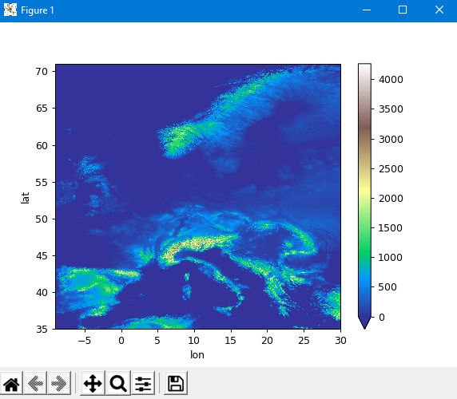
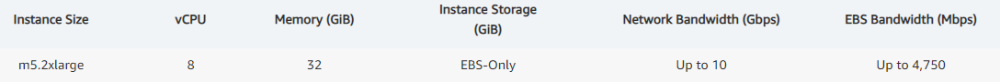
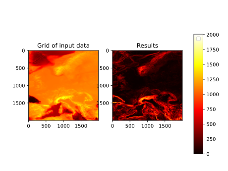

# Geodata

##### Project goals
The purpose of the task was to find areas in Europe with the greatest growth based on
minimum 10 measuring points. The results achieved were to be visualized.

##### Technologies used
Python 3.7 - a high-level programming language with an extensive library package. Thanks to its
transparent syntax it allows you to create advanced, but most of all readable source codes.

PODPAC - a Python library based on the SciPy ecosystem (Python, Numpy, SciPy, Matplotlib),
intended for simple and reproducible geospatial analytics that work locally or in the cloud.

Amazon EC2 - a web service that provides scalable computing power on demand in the AWS cloud.
It allows you to select instances with the desired parameters and perform calculations that require them,
which would be much more time consuming using the user's local power computing.

We decided to use such combination, due to the best knowledge of the programming language,
which is Python and the possibilities that comes with its extensive libraries. One of them is
precisely the PODPAC library, which we used for two most important reasons. First, it simplifies
the process of downloading geographic data from the AWS cloud to a minimum, which allows us to focus mainly
on the processing of received data. Secondly, it is an integral part of the already used in this project
language, which allowed us to stay 100% Python. During the implementation of the project, we wondered
on the possibility of using the Lambda PODPAC function in the AWS cloud, although we finally decided on
the use of Amazon EC2. This decision was made largely on the basis of the range of possibilities offered
through this service (freedom in choosing the computing power on demand, ease of configuration and just like the name itself
indicates the flexibility of this solution).

##### Implementation

The project implementation was based on the following steps:
1. Visualization the map of Europe.
2. Calculation of groups of areas consisting of 100 measurement points [10x10].
3. Count the average height height of each group.
4. Visualization of the height difference of groups of areas lying in Europe in the form of * .svg graphics.
5. Converting the obtained area data to a * .csv file.

Effects of limiting the Terrain Tiles dataset from Mapzen, containing the map of the whole world, to Europe
are shown in the figure below. Everything was made in Python and for the continent's visualization the PODPAC 
library was used due to its support for the used dataset and hence the ease of obtaining the tested data.

After pre-processing the data containing information about the height of the terrain and selecting proper areas,
it was time to determine  with NumPy the average height in each group. The speed of task execution in the local
environment was compared with using the resources of Amazon Web Services. Naturally, with the use of AWS, 
the program worked a lotfaster, thanks to much more computing power available with EC2. Additionally,
the data needed for performing calculations (in the case of using EC2) did not even leave the cloud, so the code made in
the cloud only returned the effects. 

The measured time of the data processing are shown in the table below.

|  Local environment  |  Use of AWS   |
| -------------------- | -------------------- |
| ~50 min with zoom = 8 |  ~3 min with zoom = 8 |
|     i5 processor      |        8 vCPU        |

As we can see, the difference is impressive, and it is worth mentioning that it was achieved using an instance only about 
the size of m5.2xlarge (you can also choose instances much more powerful such as m5.24xlarge with 96 CPUs).

M5 instances feature either the 1st or 2nd generation Intel Xeon Platinum 8000 series processor (Skylake-SP or Cascade Lake) with a sustained all core Turbo CPU clock speed of up to 3.1 GHz.

##### Amazon Web Services
The AWS Elastic Computing service was used to launch the program. Access to EC2 is provided via PUTTY program. The use of 
cloud computing has significantly accelerated the data processing process, as can be seen from the previous table.

##### Results achieved
The final result of the program is a * .csv file, which contains the height data with division on measurement groups. 
A * .svg file is also saved, containing a map visualization taking into account the height increase in various areas of Europe.

